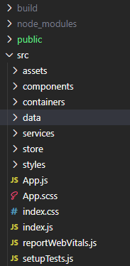
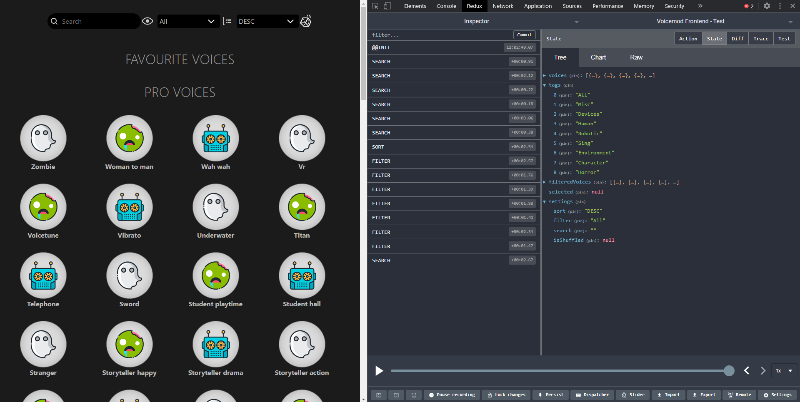
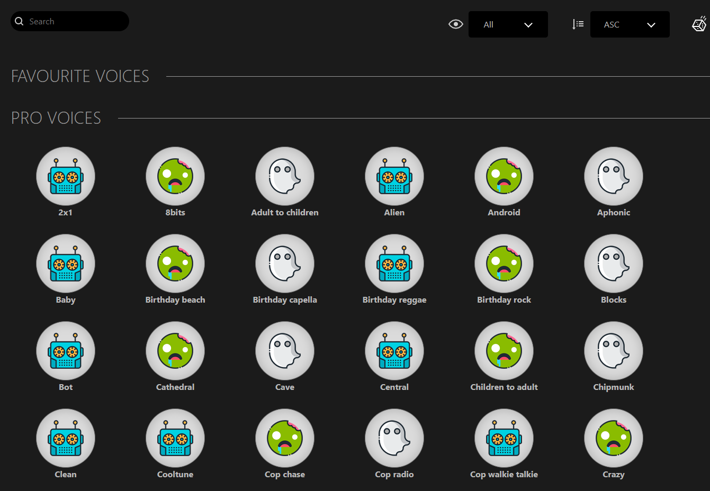
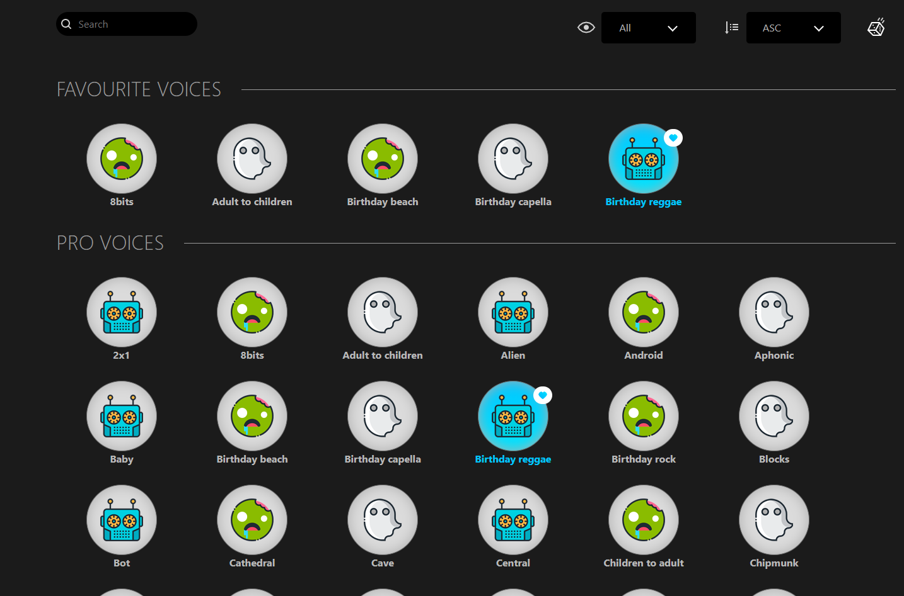
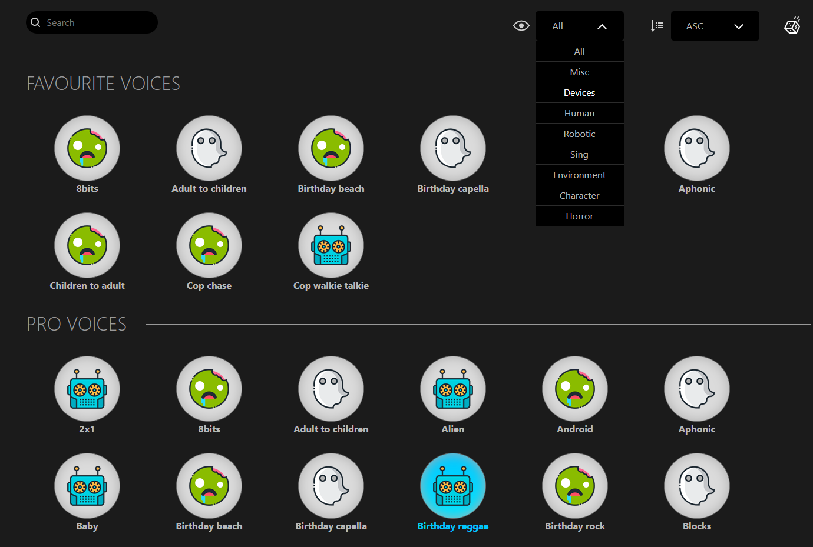
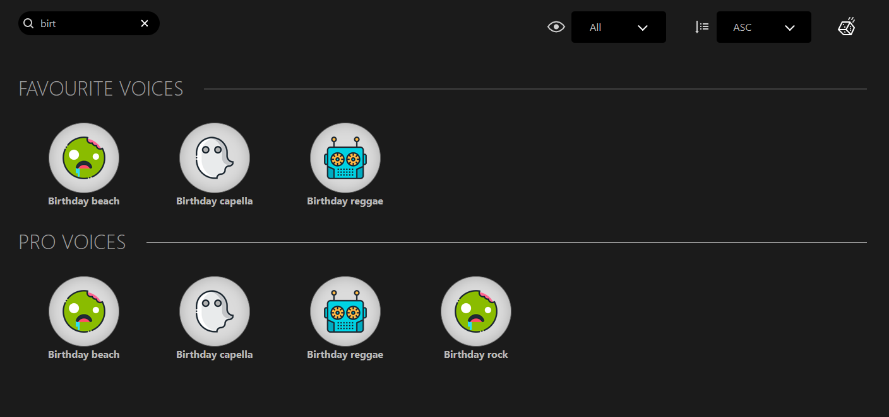

# Voicemod - Frontend test

This is a test for a Frontend dev position @ Voicemod!

### ✨ [Demo](https://voicemod-test.netlify.app)

### How was built up

This project was built up with React v16 + Redux for the state management. It was bootstrapped with [Facebook's Create React App](https://github.com/facebook/create-react-app). This is creating a basic folder structure, with an App component.


No **UI libraries** were used for this one, crafting the designs from scratch, using `SASS` style preprocessor (added to dependencies).
Ver packages json > Herramientas
Hacer introducción a todas las herramientas que se van a explicar más adelante

#### Project's sources structure



- _Assets_: Where the assets provided are stored (SVG and visual stuff).
- _Components_: Where the functional (or dumb) components are held, with no logic within. These are mainly the stuff needed to do the filters from above.
- _Containers_: Where the logic components are located. In this case just the `Dashboard` component, which helds all the logic from the voices and plays as a Index/dashboard page.
- _Data_: Stores the `voices.json` file.
- _Services_: Has the service files and utils, shared and used in many places across the app.
- _Store_: Where the Redux items are being placed
  - _Actions_: Defines the `actionTypes` (enums) and the `actions` themselves.
  - _Reducers_: Helds the two reducers (one for each of the two stores, explanied a bit later).
- _Styles_: Has the `variables.scss` file for the colors used in the app.

#### React (+ React Hooks)

Using **React v16**, with latest [React Hooks](https://es.reactjs.org/docs/hooks-intro.html) feature. This allows to build components in less time and lines, using predefined hooks such as `useState`, `useSelector` or `useEffect`.

#### Redux

For this project, two different `reducer`s were created. One of them wraps up the whole state (voices, favs and tags), and the other one was created to take care of the **settings** sub-state (_sorting, filtering, search and shuffle_).

A huge part of the app management relies on the Redux, using it instead of passing values between `components`. _I.e._: dispatching the **sort action** from the `<Sort />` component instead of returning the `event` handler to the upper component.

##### Using Redux Chrome Dev Tools


This allows to take a live look at the current state and the actions dispatched on every event at your [Google Chrome extension](https://chrome.google.com/webstore/detail/redux-devtools/lmhkpmbekcpmknklioeibfkpmmfibljd?hl=es).

#### Code format

**ESLint** combined with [Airbnb's Javascript code styling guide](https://github.com/airbnb/javascript) is being used to maintain a good code readability and cleaning, complaining (thru `warning`s) if any of these code rules was violated.
In the project, [Prettier](https://prettier.io/) and [Husky](https://github.com/typicode/husky) are also being used for supporting **ESLint** rules compliance. The first one to auto formatting on saving a file, and the second one to enable some `Git Hooks` to make sure your code is clean, formatted and no-eslint error. These `Git Hooks` are being triggered after a _code commitment_ is done from the **Dev Team**.

## Visuals






## Testing

The project is using a basic testing cycle. This round of **unit tests** is checking that each of the components are correctly built and they are connected to the `Redux`.
This has been made using [Jest](https://jestjs.io/) (_default Javascript testing tool_) and [Enzyme](https://enzymejs.github.io/enzyme/) (**\*Airbnb**'s support tool for facilitating the instanciation of the component that is going to be tested\*).

## Gitflow

The development for this project is basically splitted into two branches:

- _Develop_: This branch was used to built up the new features and do some bugfixes as well.
- _Master_: This branch is being used to do the **deployment** and contains the same foundation as the `develop` branch with some adittional patches (i.e. making the builds to run correctly).
  All the branches are intended to have a clean commits structure, isolating the main functionality. So, in the case of a rollback, it will be easier for the team to find the encapsulated functionality within a specific commit and revert it.

Some Git tools were used here to ensure this encapsulation. I.e.: by squashing the commits:

```
git rebase --interactive HEAD~N
```

Also, the commits messages are following [this recommended standard](https://chris.beams.io/posts/git-commit/). Basically, each commit contains a _one-lined_ title or general description of what is intended to solve, and a detailed description of each of the changes with some explanation on them.

## Project planning

A [board](https://github.com/danibeam/voicemod-frontend/projects/1) was created for this project. This is just for _self-management_ of the issues and the stuff needed to be done.

## Install

```sh
npm i
```

This will install all the needed dependencies for the project.

## Usage

```sh
npm start
```

This will run the app (localhost:3000) in your fav Browser's new tab,

## Run tests

```sh
npm test
```

This will initiate the testing cycle for all the testing units throughout the app.

## Author

👤 **Daniel Belmonte**

- Website: dbelmonte.me
- Github: [@danibeam97](https://github.com/danibeam97)
- LinkedIn: [@daniel-belmonte](https://linkedin.com/in/daniel-belmonte)

## Show your support

Give a ⭐️ if this project helped you!

---

_This README was generated with ❤️ by [readme-md-generator](https://github.com/kefranabg/readme-md-generator)_

## Contributing

Pull requests are welcome. For major changes, please open an issue first to discuss what you would like to change.

Please make sure to update tests as appropriate.

## License

[MIT](https://choosealicense.com/licenses/mit/)
